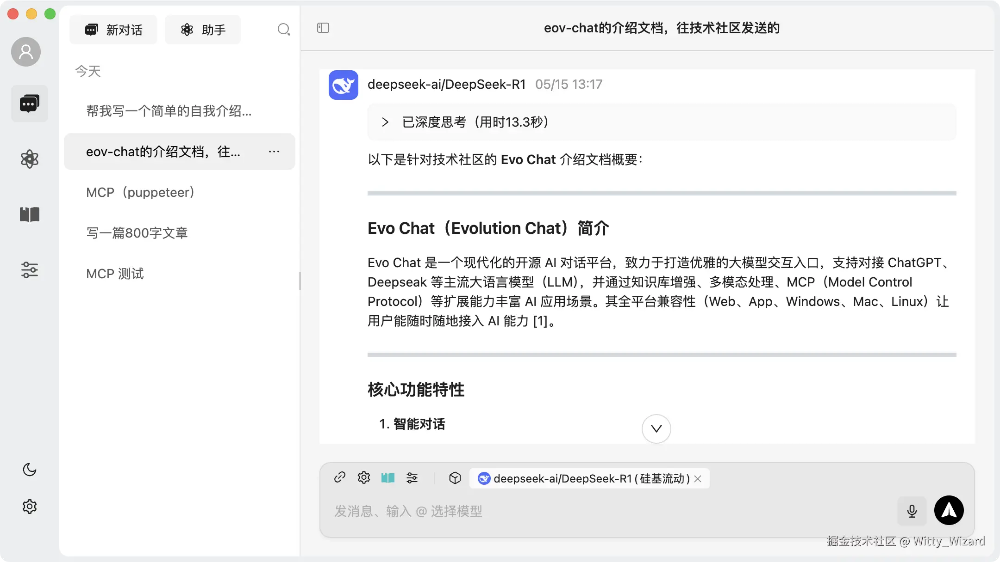
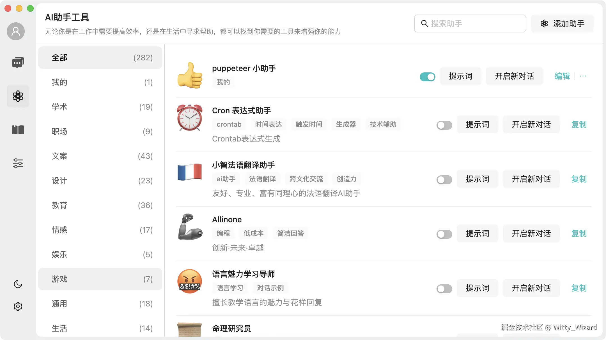
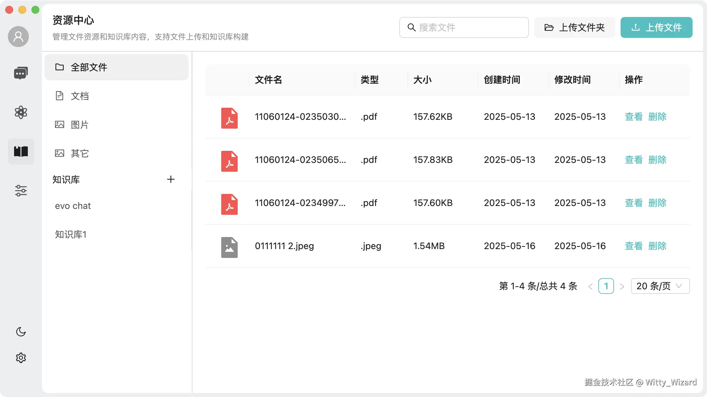
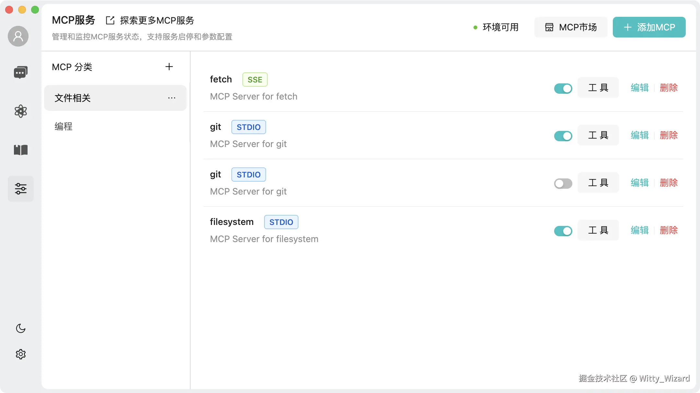
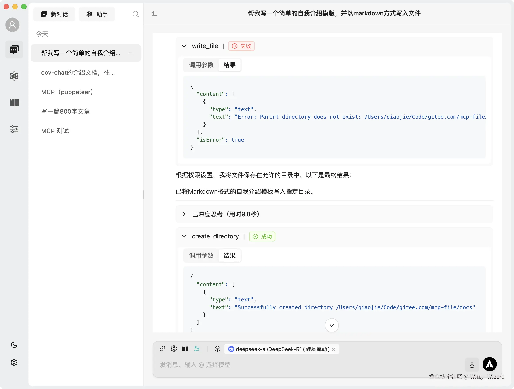
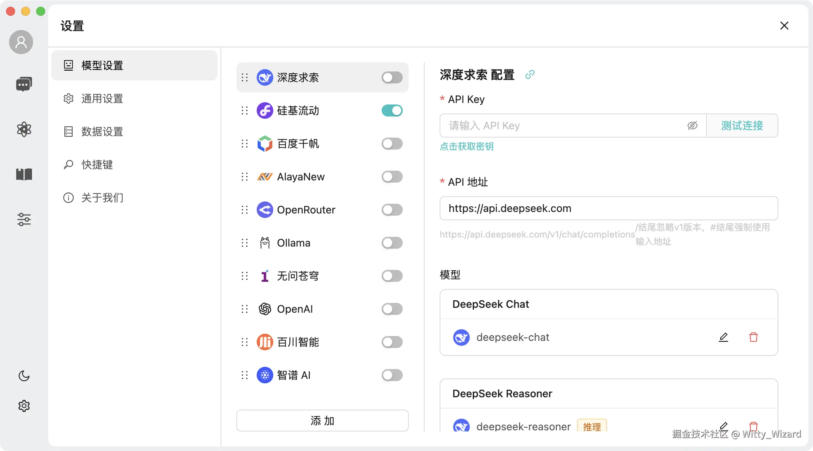
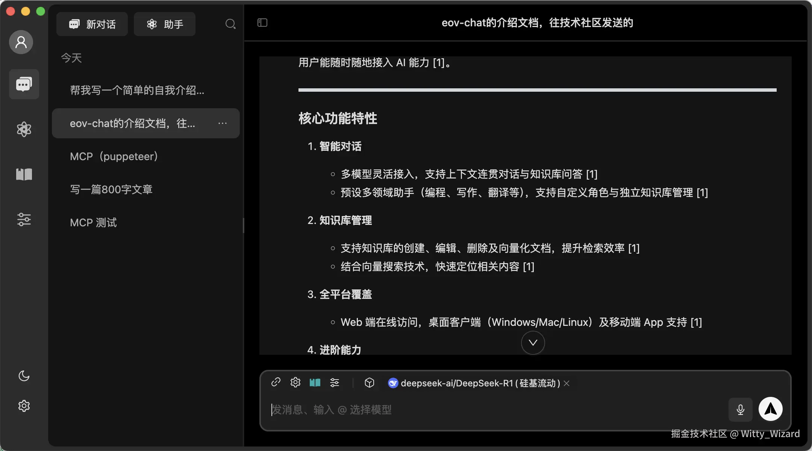

<div align="center">

<h1>Welcome to Evo Chat 👋</h1>

[English](./README.md) | [简体中文](./README.zh.md)

</div>

<p>
  
  <a href="http://101.42.26.70:3000/doc" target="_blank">
    
  </a>
  <a href="https://github.com/evo-family/evo-chat/graphs/community" target="_blank">
    
  </a>
  <a href="https://github.com/evo-family/evo-chat/master/LICENSE" target="_blank">
    
  </a>
</p>

Evo Chat (Evolution Chat) is a modern open-source AI conversation platform dedicated to creating the most elegant interface for large model interactions. It supports integration with mainstream Large Language Model (LLM) providers such as ChatGPT, Deepseak, and more, while continuously evolving with enhanced capabilities like knowledge base augmentation, multimodal processing, and MCP (Model Control Protocol). Supporting cross-platform deployment (Web, App, Windows, Mac, Linux), it provides ubiquitous AI accessibility for users.

## 🖼️ Interface Display

- Homepage
  

- Assistant
  

- Knowledge Base
  

- MCP
  

- MCP Session
  

- Model Management
  

- Dark Mode
  

## ✨ Features

- [x] 💬 Intelligent Conversation

  - [x] Support for multiple model integration, providing flexible conversation capabilities
  - [x] Context-aware conversations maintaining coherence
  - [x] Knowledge base Q&A for quick information retrieval

- [x] 🚀 Knowledge Base Management

  - [x] Support for creating, editing, and deleting knowledge bases
  - [x] Document vectorization for improved retrieval efficiency
  - [x] Vector search for quick content location

- [x] 📁 File Management

  - [x] Support for file upload, preview, and deletion
  - [x] File categorization management
  - [x] Batch operations for improved efficiency

- [x] 💻 Cross-Platform Support

  - [x] Web access for anywhere, anytime use
  - [x] Desktop client support (Windows, Mac, Linux)
  - [x] Mobile app with smooth experience

- [x] 🤖 Intelligent Assistants

  - [x] Pre-configured professional domain assistants (programming, writing, translation, etc.)
  - [x] Customizable assistant roles and domains
  - [x] Independent knowledge base management for assistants
  - [x] Quick switching between different assistant scenarios

- [x] 🔮 Advanced Features
  - [x] MCP (Model Control Protocol) protocol support

## 📁 Project Structure

```bash
.
├── packages
│   ├── b-component            # Shared business component library
│   ├── data-store             # Data management
│   ├── knowledge-service      # Knowledge service (electron project only)
│   ├── pglite-manager         # pglite local PostgreSQL database
│   ├── platform-bridge        # Cross-platform capabilities
│   ├── types                  # Global type definitions
│   └── utils                  # Common utility functions
├── projects
│   ├── electron-app           # Desktop client
│   ├── h5                     # Mobile application
│   └── web                    # Web application
├── scripts
│   ├── build                 # Build-related scripts
│   └── utils                 # Utility scripts
└── docs                      # Project documentation
```

## 📦 Development

### Requirements

- Node.js >= 20.18.3
- pnpm >= 9.15.5

### Getting Started

```bash
# Clone the project
git clone https://github.com/evo-family/evo-chat.git

# Enter project directory
cd evo-chat

# Install dependencies
pnpm install

# Start web
pnpm run dev:web

# Start h5
pnpm run dev:h5

# Start h5
pnpm run dev:h5

# Start electron
pnpm run dev:client
```

## Contact

Add WeChat evo-chat to contact us

## 👥 Contribution Guide

Welcome to the Evo Chat open source community! We appreciate all contributions, whether it's submitting code, reporting issues, or improving documentation.

### How to Contribute

1. Fork this repository
2. Create your feature branch ( git checkout -b feature/AmazingFeature )
3. Commit your changes ( git commit -m 'Add some AmazingFeature' )
4. Push to the branch ( git push origin feature/AmazingFeature )
5. Submit a Pull Request

### Contributors

Thanks to all contributors:

<a href="https://github.com/evo-family/evo-chat/graphs/contributors">
  
</a>

## 📄 开源协议

This project is licensed under the [Apache 2.0](LICENSE) License.
